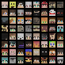

# Craftify



Generate Minecraft Skin by using DCGAN. I trained over 900,000 skins(dataset: dataset: https://www.kaggle.com/datasets/sha2048/minecraft-skin-dataset/data)

This is my first project in Deep Learning. Forgive my poor code quality and lack of comments :D

I used to train the whole skin file(64x64), but the result is not good. So I only train the head part(8x8) of the skin. The model in `pth_release/` folder **is trained by the head part**.

The dataset is 64x64 skin images, if you only want to train the head part like me, you can execute `python3 utils.py` after downloading and unziping the dataset and move it to `data/skin` folder.

```
|--data
|  |--skin
|     |--Skin
```

## Usage

### 1. Download Dataset
The dataset is provided by `SHA2048`. You can download it from [here](https://www.kaggle.com/datasets/sha2048/minecraft-skin-dataset/data).

And unzip to `data/skin/` folder.

### 2. Train
```bash
python3 main.py
```

> You may need to change the path of the dataset in `main.py 236L`.

This command will automatically train the model and save the model to `pth_release/` folder, and predict Minecraft skin(head) images to `output/` folder.

```py
# main.py 255L
# If you dont want to train, you can comment this two lines
params1 = train_flow(**params)
params.update(params1)

# If you don't want to train, you can uncomment this line
# params["netG_path"] = "pth_release/t1_g_head.pth"
```