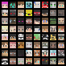

# Craftify




Generate Minecraft Skin by using DCGAN. I trained over 900,000 skins(dataset: dataset: https://www.kaggle.com/datasets/sha2048/minecraft-skin-dataset/data)

This is my first project in Deep Learning. Forgive my poor code quality and lack of comments :D

I used to train the whole skin file(64x64), but the result is not good. So I only train the head part(8x8) of the skin. The model in `pth_release/` folder **is trained by the head part**.

The dataset is 64x64 skin images, if you only want to train the head part like me, you can execute `python3 utils.py` after downloading and unziping the dataset and move it to `data/skin` folder.

```
|--data
|  |--skin
|     |--Skins
```

## Further work
- [ ] Try SAGAN(https://export.arxiv.org/pdf/1805.08318)
- [ ] Train the full skin
 
## Demo(Head part)

simple readme :p
[https://api.soulter.top/craftify](https://api.soulter.top/craftify)

image generate:
[https://api.soulter.top/craftify/predict](https://api.soulter.top/craftify/predict)

## Usage

### Arguments
```py 
args.add_argument("--dataroot", type=str, default="data/skin/SkinsOnlyHead") # dataset root path
args.add_argument("--type", type=str, default="head") # head or full skin training
args.add_argument("--onlypredict", type=bool, default=False) # only predict. default model is pth_release/t1_g_head.pth
args.add_argument("--gmodelpath", type=str, default="pth_release/t1_g_head.pth") # generator model path
```

### Download Dataset
The dataset is provided by `SHA2048`. You can download it from [here](https://www.kaggle.com/datasets/sha2048/minecraft-skin-dataset/data).

And unzip to `data/skin/` folder.

### Train(Only Head)
```bash
python3 crop_head.py
python3 main.py --type head --dataroot data/skin/Skins_head_88
```

This command will automatically train the model and save the model to `pth_release/` folder, and predict Minecraft skin(head) images to `output/` folder.

### Train(Full Skin Part)
```bash
python3 clean_data_full_skin.py
python3 main.py --type full --dataroot data/skin/Skins
```

This command will automatically train the model and save the model to `pth_release/` folder, and predict Minecraft skin(head) images to `output/` folder.

